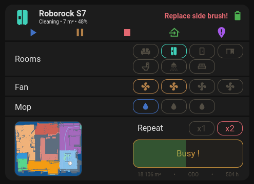
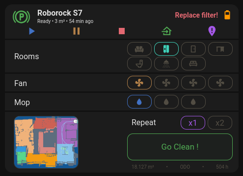
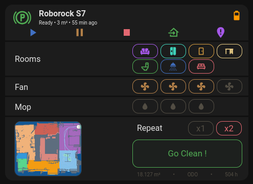

My roborock S7 card. Using Roborock integration sensors.

Make sure you have config in your configuration.yaml to get it working

roborock_config.yaml contains:
1. input_boolean for each room and one more that toggles between 1x and 2x repeat
2. toggle all rooms script
3. start cleaning script

roborock_card.yaml contains card yaml code

